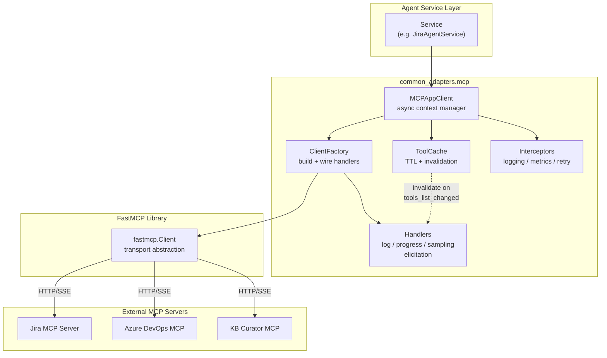
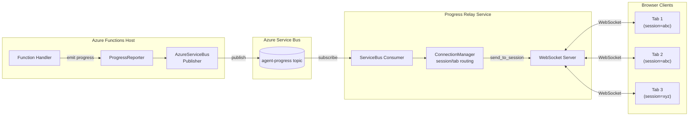

# common-adapters Usage Guide

## Overview

`common-adapters` is a shared Python package providing cloud-agnostic services for forgeX agents. The package follows a **pure service** design: agents pass explicit configuration, and the package provides services without reading environment variables.

**Design Principle**: *"Agent decides what it needs, and common package will service whatever agent needs"*

## Installation

### Development (editable install)
```bash
pip install -e D:\forgex-rearch\forgexpackages
```

### Production
```bash
pip install git+https://github.com/Coforge-forgeX/forgexpackages.git@main
```

## Azure Functions Setup

For Azure Functions, add `PYTHONPATH` to `local.settings.json`:

```json
{
  "Values": {
    "PYTHONPATH": "D:\\forgex-rearch\\forgexpackages\\src;D:\\venv-arch\\ba\\Lib\\site-packages;D:\\forgex-rearch\\BusinessAnalyst\\src"
  }
}
```

---

## Modules

### 1. Cloud Provider (`common_adapters.cloud`)

#### CloudProvider Enum
```python
from common_adapters.cloud import CloudProvider

# Parse from string (case-insensitive)
provider = CloudProvider.parse("azure")  # CloudProvider.AZURE
provider = CloudProvider.parse("aws")    # CloudProvider.AWS
provider = CloudProvider.parse("gcp")    # CloudProvider.GCP
provider = CloudProvider.parse("local")  # CloudProvider.LOCAL
```

#### Secret Providers
```python
from common_adapters.cloud import (
    EnvSecretProvider,
    AzureKeyVaultSecretProvider,
    AwsSecretsManagerProvider,
    GcpSecretManagerProvider,
)

# Environment-based secrets
env_secrets = EnvSecretProvider(env_getter=os.getenv)
value = env_secrets.get_secret("MY_SECRET_KEY")

# Azure Key Vault secrets
kv_secrets = AzureKeyVaultSecretProvider(keyvault_url="https://my-vault.vault.azure.net")
value = kv_secrets.get_secret("my-secret")

# AWS Secrets Manager
aws_secrets = AwsSecretsManagerProvider(region_name="us-east-1")
value = aws_secrets.get_secret("my-secret")

# GCP Secret Manager
gcp_secrets = GcpSecretManagerProvider(project_id="my-gcp-project")
value = gcp_secrets.get_secret("my-secret")
```

#### Object Storage
```python
from common_adapters.cloud import (
    AzureBlobStorageService,
    S3StorageService,
    GcsStorageService,
)

# Azure Blob Storage
azure_storage = AzureBlobStorageService(
    connection_string="DefaultEndpointsProtocol=https;AccountName=..."
)
container = azure_storage.get_container_client("container-name")
blob = container.download_blob("blob-path")
container.upload_blob(name="blob-path", data="content", overwrite=True, content_type="text/plain")

# AWS S3
s3_storage = S3StorageService(region_name="us-east-1")
bucket = s3_storage.get_container_client("bucket-name")
blob = bucket.download_blob("key")
bucket.upload_blob(name="key", data="content", overwrite=True, content_type="text/plain")

# Google Cloud Storage
gcs_storage = GcsStorageService(project_id="my-gcp-project")
bucket = gcs_storage.get_container_client("bucket-name")
blob = bucket.download_blob("object-path")
bucket.upload_blob(name="object-path", data="content", overwrite=True, content_type="text/plain")
```

---

### 2. Progress Reporting (`common_adapters.progress`)

#### Create Publishers
```python
from common_adapters.progress import (
    create_null_publisher,
    create_log_publisher,
    create_local_relay_publisher,
    create_azure_servicebus_publisher,
)

# No-op publisher (for testing)
publisher = create_null_publisher()

# Logging publisher
publisher = create_log_publisher()

# Local HTTP relay (for local dev)
publisher = create_local_relay_publisher(url="http://127.0.0.1:8090/publish")

# Azure Service Bus (topic)
publisher = create_azure_servicebus_publisher(
    connection_string="Endpoint=sb://...",
    entity_name="ba-dev",
    entity_type="topic"
)

# Azure Service Bus (queue)
publisher = create_azure_servicebus_publisher(
    connection_string="Endpoint=sb://...",
    entity_name="my-queue",
    entity_type="queue"
)
```

#### Create Progress Reporter
```python
from common_adapters.progress import create_progress_reporter

reporter = create_progress_reporter(
    publisher=publisher,
    workspace_id=1003,
    agent_id=7,
    job_id="job-123",
    heartbeat_interval_s=2.0
)

# Report progress
await reporter.report("Processing started", percentage=10)
await reporter.report("Analyzing data", percentage=50)
await reporter.complete("Done!")
await reporter.fail("Something went wrong")
```

---

### 3. MCP Client (`common_adapters.mcp`)

#### MCPSettings Configuration
```python
from common_adapters.mcp import MCPSettings

settings = MCPSettings(
    mcp_jira_url="https://jira-server/mcp",
    mcp_ado_url="https://ado-server/mcp",
    mcp_timeout_s=30,
    mcp_init_timeout_s=10,
    mcp_auth_token="bearer-token",
    mcp_subscription_key="subscription-key",
)
```

#### MCP App Client
```python
from common_adapters.mcp import MCPAppClient, MCPSettings

settings = MCPSettings(
    mcp_jira_url="https://jira.example.com/mcp",
    mcp_timeout_s=30,
)

client = MCPAppClient(
    settings=settings,
    cache_ttl_s=180,
)

# Call a tool
result = await client.call_tool("jira_search", {"query": "project = BA"})

# List available tools
tools = await client.list_tools()
```

---

### 4. Notifications (`common_adapters.notifications`)

#### WebSocket Connection Manager
```python
from common_adapters.notifications import ConnectionManager, BroadcastMode

manager = ConnectionManager(
    broadcast_mode=BroadcastMode.SESSION,
    max_queue_size=200,
    ping_interval_s=25,
    idle_timeout_s=180,
)

# Accept connection
await manager.connect(websocket, session_id="session-123")

# Send message to session
await manager.send_to_session("session-123", {"type": "progress", "data": {...}})

# Broadcast to all
await manager.broadcast({"type": "system", "message": "Server restarting"})

# Disconnect
await manager.disconnect(websocket)
```

---

## Migration Guide

### Old API (env-based) → New API (explicit)

#### Cloud Provider
```python
# OLD (removed)
from common_adapters.cloud import resolve_cloud_provider
provider = resolve_cloud_provider()  # Read CLOUD_PROVIDER env

# NEW
from common_adapters.cloud import CloudProvider
provider = CloudProvider.parse(os.getenv("CLOUD_PROVIDER", "local"))
```

#### Secret Provider
```python
# OLD (removed)
from common_adapters.cloud import get_secret_provider
provider = get_secret_provider()  # Auto-detect from env

# NEW
from common_adapters.cloud import (
    EnvSecretProvider,
    AzureKeyVaultSecretProvider,
    AwsSecretsManagerProvider,
    GcpSecretManagerProvider,
)

secret_provider_type = os.getenv("SECRET_PROVIDER", "env")
if secret_provider_type == "env":
    provider = EnvSecretProvider(env_getter=os.getenv)
elif secret_provider_type == "azure_keyvault":
    provider = AzureKeyVaultSecretProvider(keyvault_url=os.getenv("KEYVAULT_URL"))
elif secret_provider_type == "aws_secrets_manager":
    provider = AwsSecretsManagerProvider(region_name=os.getenv("AWS_REGION"))
elif secret_provider_type == "gcp_secret_manager":
    provider = GcpSecretManagerProvider(project_id=os.getenv("GCP_PROJECT_ID"))
```

#### Object Storage
```python
# OLD (removed)
from common_adapters.cloud import get_object_storage_service
storage = get_object_storage_service()  # Auto-detect from env

# NEW
from common_adapters.cloud import (
    AzureBlobStorageService,
    S3StorageService,
    GcsStorageService,
)

storage_type = os.getenv("OBJECT_STORAGE_PROVIDER", "azure_blob")
if storage_type == "azure_blob":
    storage = AzureBlobStorageService(
        connection_string=os.getenv("AZURE_BLOB_STORAGE_CONNECTION_STRING")
    )
elif storage_type in {"s3", "aws_s3"}:
    storage = S3StorageService(region_name=os.getenv("AWS_REGION", "us-east-1"))
elif storage_type in {"gcs", "gcp_gcs"}:
    storage = GcsStorageService(project_id=os.getenv("GCP_PROJECT_ID"))
```

#### Progress Publisher
```python
# OLD (removed)
from common_adapters.progress import get_progress_publisher
publisher = get_progress_publisher()  # Auto-detect from env

# NEW
from common_adapters.progress import (
    create_null_publisher,
    create_log_publisher,
    create_local_relay_publisher,
    create_azure_servicebus_publisher,
)

backend = os.getenv("PROGRESS_BACKEND", "log")
if backend == "null":
    publisher = create_null_publisher()
elif backend == "log":
    publisher = create_log_publisher()
elif backend == "local_relay":
    publisher = create_local_relay_publisher(url=os.getenv("PROGRESS_LOCAL_RELAY_URL"))
elif backend == "azure_service_bus":
    publisher = create_azure_servicebus_publisher(
        connection_string=os.getenv("SERVICE_BUS_CONNECTION_STRING"),
        entity_name=os.getenv("PROGRESS_TOPIC") or os.getenv("PROGRESS_QUEUE"),
        entity_type="topic" if os.getenv("PROGRESS_TOPIC") else "queue"
    )
```

#### MCP Settings
```python
# OLD (removed)
from common_adapters.mcp import mcp_settings  # Global singleton

# NEW
from common_adapters.mcp import MCPSettings

settings = MCPSettings(
    mcp_jira_url=os.getenv("MCP_JIRA_URL"),
    mcp_ado_url=os.getenv("MCP_ADO_URL"),
    mcp_timeout_s=int(os.getenv("MCP_TIMEOUT_S", "30")),
    mcp_init_timeout_s=int(os.getenv("MCP_INIT_TIMEOUT_S", "10")),
    mcp_auth_token=os.getenv("MCP_AUTH_TOKEN"),
    mcp_subscription_key=os.getenv("MCP_SUBSCRIPTION_KEY"),
)
```

---

## Example: Agent Bootstrap

```python
import os
from common_adapters.cloud import (
    CloudProvider,
    EnvSecretProvider,
    AzureBlobStorageService,
)
from common_adapters.progress import (
    create_azure_servicebus_publisher,
    create_progress_reporter,
)
from common_adapters.mcp import MCPSettings, MCPAppClient


def bootstrap_agent():
    """Initialize all services from environment variables."""
    
    # Cloud provider
    cloud = CloudProvider.parse(os.getenv("CLOUD_PROVIDER", "local"))
    
    # Secrets
    secrets = EnvSecretProvider(env_getter=os.getenv)
    
    # Storage
    storage = AzureBlobStorageService(
        connection_string=os.getenv("AZURE_BLOB_STORAGE_CONNECTION_STRING")
    )
    
    # Progress publisher
    publisher = create_azure_servicebus_publisher(
        connection_string=os.getenv("SERVICE_BUS_CONNECTION_STRING"),
        entity_name=os.getenv("PROGRESS_TOPIC", "ba-dev"),
        entity_type="topic"
    )
    
    # MCP client
    mcp_settings = MCPSettings(
        mcp_jira_url=os.getenv("MCP_JIRA_URL"),
        mcp_timeout_s=int(os.getenv("MCP_TIMEOUT_S", "30")),
    )
    mcp_client = MCPAppClient(settings=mcp_settings, cache_ttl_s=180)
    
    return {
        "cloud": cloud,
        "secrets": secrets,
        "storage": storage,
        "publisher": publisher,
        "mcp_client": mcp_client,
    }
```

---

## Architecture & Integration Patterns

This section provides detailed architecture documentation for each module.

### MCP Client Framework Architecture

The MCP Client Manager provides a high-level wrapper around FastMCP Client for connecting to external MCP servers (Jira, Azure DevOps, custom servers).

#### Components

| Component | Purpose |
|-----------|---------|
| `MCPAppClient` | High-level facade with lifecycle management |
| `ClientFactory` | Builds configured FastMCP clients |
| `ToolCache` | TTL cache with server-notification invalidation |
| `Handlers` | Adapters for log/progress/sampling/elicitation |
| `Interceptors` | Composable call interceptors for tracing/metrics |
| `ClientBuildOptions` | Configuration for timeouts, auth, roots |

#### Architecture Diagram



#### Key Flows

1. Service creates `MCPAppClient` with source URL and options
2. `ClientFactory` builds FastMCP client with handler wiring
3. `ToolCache` caches `list_tools()` results with TTL (180s default)
4. Server notifications (`tools_list_changed`) trigger cache invalidation
5. `Interceptors` wrap each `call_tool()` for logging/metrics/retry

#### Complete Usage Example

```python
from common_adapters.mcp import (
    MCPAppClient,
    ClientBuildOptions,
    LoggingInterceptor,
    MetricsInterceptor,
)

async def call_jira_tool(tool_name: str, args: dict):
    opts = ClientBuildOptions(timeout_s=30.0)
    async with MCPAppClient(
        source="http://jira-mcp-server/mcp",
        options=opts,
    ) as mcp:
        # List available tools (cached)
        tools = await mcp.list_tools_cached()
        
        # Call a specific tool
        result = await mcp.call_tool(tool_name, args)
        return result

# With interceptors for observability
async def call_with_tracing():
    interceptors = [
        LoggingInterceptor(log_args=True, log_result=False),
        MetricsInterceptor(),
    ]
    
    async with MCPAppClient(
        source="http://mcp-server/mcp",
        options=ClientBuildOptions(timeout_s=30.0),
        interceptors=interceptors,
    ) as mcp:
        result = await mcp.call_tool("create_issue", {"summary": "Bug fix"})
        
        # Get collected metrics
        metrics_interceptor = interceptors[1]
        print(metrics_interceptor.get_metrics())
```

#### MCP Configuration Reference

| Variable | Default | Description |
|----------|---------|-------------|
| `MCP_SERVER_URL` | - | Default MCP server URL |
| `MCP_JIRA_URL` | - | Jira MCP server URL |
| `MCP_ADO_URL` | - | Azure DevOps MCP server URL |
| `MCP_TIMEOUT_S` | `30` | Request timeout in seconds |
| `MCP_INIT_TIMEOUT_S` | - | Init handshake timeout |
| `MCP_CACHE_TTL_S` | `180` | Tool cache TTL in seconds |
| `MCP_AUTH_TOKEN` | - | Bearer token for auth |
| `MCP_SUBSCRIPTION_KEY` | - | API subscription key |

---

### Push Notification Service Architecture

The Push Notification Service enables real-time event delivery to browser clients via WebSocket with connection reliability and broadcast modes.

#### Components

| Component | Purpose |
|-----------|---------|
| `ConnectionManager` | WebSocket connection management with session/tab routing |
| `Connection` | Represents a single browser tab connection |
| `ServerEvent` | Protocol types for server-to-browser events |
| `ClientCommand` | Protocol types for browser-to-server commands |
| `BroadcastMode` | Configuration for tab vs session broadcast |

#### Features

- **Session/Tab Routing**: Messages can target specific tabs or broadcast to all tabs in a session
- **Single-Writer Pattern**: Prevents concurrent send issues under async concurrency
- **Backpressure Handling**: Bounded queues with drop policy for slow clients
- **Heartbeat/Keepalive**: Server pings to keep connections alive through proxies
- **Graceful Shutdown**: Clean disconnection of all clients

#### Message Protocol

**Server → Browser Events:**
- `status`: Connection status updates
- `progress`: Progress updates for long-running operations
- `assistant_message`: Messages from the agent
- `ping`: Server heartbeat
- `elicitation_request`: Request for user input

**Browser → Server Commands:**
- `user_message`: User messages to the agent
- `elicitation_response`: Response to elicitation requests
- `pong`: Response to server ping

#### Complete Usage Example

```python
from common_adapters.notifications import (
    ConnectionManager,
    Connection,
    BroadcastMode,
    event_to_dict,
    parse_client_command,
)

# Initialize manager
manager = ConnectionManager(
    max_queue=200,
    ping_interval_s=25,
    idle_timeout_s=180,
)

# On WebSocket connect
async def on_connect(websocket, user_session_id: str, tab_id: str):
    conn = await manager.connect(websocket, user_session_id, tab_id)
    return conn

# Send to specific tab (for elicitation)
await manager.send_to_tab(session_id, tab_id, {
    "type": "elicitation_request",
    "elicitation_id": "elic_123",
    "message": "Please provide details",
    "fields": [{"name": "summary", "type": "str"}]
})

# Broadcast progress to all tabs in session
await manager.send_to_session(session_id, {
    "type": "progress",
    "status": "running",
    "progress_percent": 50,
})

# On WebSocket disconnect
await manager.disconnect(conn)
```

#### Notification Configuration Reference

| Variable | Default | Description |
|----------|---------|-------------|
| `BROADCAST_MODE` | `tab` | Broadcast mode: `tab` or `session` |
| `WS_MAX_QUEUE` | `200` | Max messages per WebSocket queue |
| `WS_PING_INTERVAL_S` | `25` | Heartbeat interval in seconds |
| `WS_IDLE_TIMEOUT_S` | `180` | Disconnect idle clients after seconds |

---

### Progress Reporting Architecture

The Progress module provides transport-agnostic progress reporting for long-running operations.

#### Real-time Progress & Notification Architecture



#### Canonical Progress Event Contract

```json
{
  "operation": "handle_ba_message",
  "status": "queued|running|completed|failed",
  "message": "human readable status",
  "user_id": "247",
  "conversation_id": "20260730_114809_e99eea61",
  "job_id": null,
  "correlation_id": "uuid",
  "provider": "business-analyst",
  "metadata": {
    "progress_percent": 30,
    "heartbeat": true,
    "heartbeat_count": 3,
    "elapsed_seconds": 9,
    "run_id": "abc123",
    "event_seq": 5
  },
  "timestamp": "ISO-8601"
}
```

#### Contract Rules

- `status` drives UI state machine (`queued`, `running`, `completed`, `failed`, `cancelled`)
- `operation` maps to endpoint/workflow name
- `conversation_id` or `job_id` is routing key for websocket channel
- `metadata` is extensible and must remain backward-compatible
- `run_id` + `event_seq` enable ordering/filtering events

#### Standard Progress Milestones

| Milestone | Percent | Description |
|-----------|---------|-------------|
| Request accepted | 5% | Initial acknowledgment |
| Preparing context | 10% | Preload started |
| Context ready | 20% | Preload complete |
| Workflow started | 30% | Tool execution begins |
| Processing | 31-95% | Heartbeat growth during work |
| Completed | 100% | Success |
| Failed | 95-100% | Terminal error |

#### Complete Usage Example

```python
from common_adapters.progress import (
    create_progress_reporter,
    create_azure_servicebus_publisher,
    create_local_relay_publisher,
    ProgressEvent,
)

# Create publisher based on environment
publisher = create_azure_servicebus_publisher(
    connection_string="Endpoint=sb://...",
    entity_name="ba-dev",
    entity_type="topic",
)

# Or for local development
publisher = create_local_relay_publisher(
    url="http://127.0.0.1:8090/publish"
)

# Create reporter for an operation
reporter = create_progress_reporter(
    publisher,
    operation="generate_document",
    user_id="user-123",
    conversation_id="conv-456",
    job_id="job-789",
    correlation_id="corr-abc",
    provider="business_analyst",
)

# Emit progress events
await reporter.emit(
    status="queued",
    message="Request accepted",
    metadata={"progress_percent": 5}
)

await reporter.emit(
    status="running",
    message="Processing...",
    metadata={"progress_percent": 50, "heartbeat": True}
)

await reporter.emit(
    status="completed",
    message="Done",
    metadata={"progress_percent": 100}
)
```

#### Progress Configuration Reference

| Variable | Default | Description |
|----------|---------|-------------|
| `PROGRESS_BACKEND` | `auto` | Backend: `auto`, `none`, `log`, `local_relay`, `azure_service_bus`, `aws_eventbridge` |
| `PROGRESS_LOCAL_RELAY_URL` | `http://127.0.0.1:8090/publish` | Local relay publish URL |
| `SERVICE_BUS_CONNECTION_STRING` | - | Azure Service Bus connection |
| `PROGRESS_TOPIC` | `agent-progress` | Service Bus topic name (takes precedence over queue) |
| `PROGRESS_QUEUE` | - | Service Bus queue name (Basic tier only, used when topic is unset) |
| `PROGRESS_EVENT_BUS` | `default` | AWS EventBridge bus name |
| `PROGRESS_HEARTBEAT_INTERVAL_SECONDS` | `3` | Heartbeat interval |

---

### Cloud Module Architecture

The Cloud module provides cloud-agnostic abstractions for provider detection, secrets, and object storage across Azure, AWS, GCP, and local environments.

#### Available Exports

```python
from common_adapters.cloud import (
    # Provider enum
    CloudProvider,
    # Secrets
    SecretProvider,
    EnvSecretProvider,
    AzureKeyVaultSecretProvider,
    AwsSecretsManagerProvider,
    GcpSecretManagerProvider,
    extract_from_json,
    # Object Storage
    ObjectStorageService,
    AzureBlobStorageService,
    S3StorageService,
    GcsStorageService,
    BlobItem,
    BlobDownload,
)
```

#### Cloud Configuration Reference

| Variable | Default | Description |
|----------|---------|-------------|
| `CLOUD_PROVIDER` | `local` | Provider: `azure`, `aws`, `gcp`, `local` |
| `SECRET_PROVIDER` | `env` | Secret backend: `env`, `azure_keyvault`, `aws_secrets_manager`, `gcp_secret_manager` |
| `OBJECT_STORAGE_PROVIDER` | - | Storage backend: `azure_blob`, `aws_s3`, `gcp_gcs` |
| `AZURE_BLOB_STORAGE_CONNECTION_STRING` | - | Azure Blob connection string |
| `BLOB_STORAGE_CONNECTION_STRING` | - | Alternative Azure Blob connection |
| `AWS_REGION` | - | AWS region for S3 and Secrets Manager |
| `KEYVAULT_URL` | - | Azure Key Vault URL |
| `GCP_PROJECT_ID` | - | GCP project ID for GCS and Secret Manager |
| `GOOGLE_CLOUD_PROJECT` | - | Alternative GCP project ID (auto-detected in Cloud Run/Functions) |

---

## Agent Integration Pattern

Each agent creates thin wrappers in `src/core/` that:
1. Re-export from `common_adapters`
2. Add agent-specific auto-resolution from environment variables

### Recommended Directory Structure

```text
src/core/
├── __init__.py
├── cloud/
│   ├── __init__.py          # Re-exports from common_adapters + agent-specific
│   ├── provider.py          # Agent-specific resolve_cloud_provider()
│   ├── object_storage.py    # Agent-specific get_object_storage_service()
│   └── secrets.py           # Agent-specific get_secret_provider()
├── mcp/
│   └── __init__.py          # Re-exports from common_adapters
├── notifications/
│   ├── __init__.py          # Re-exports from common_adapters + agent-specific
│   └── broadcast.py         # Agent-specific load_broadcast_mode()
├── progress/
│   ├── __init__.py          # Re-exports from common_adapters + agent-specific
│   ├── factory.py           # Agent-specific create_progress_reporter()
│   └── registry.py          # Agent-specific get_progress_publisher()
└── services/
    └── ...
```

### Example: Agent Cloud __init__.py

```python
# src/core/cloud/__init__.py
"""Cloud Abstraction Layer (Agent)

Re-exports from common_adapters.cloud with agent-specific
auto-resolution factories from environment variables.

Supports: Azure, AWS, GCP, Local
"""

from common_adapters.cloud import (
    CloudProvider,
    SecretProvider,
    EnvSecretProvider,
    AzureKeyVaultSecretProvider,
    AwsSecretsManagerProvider,
    GcpSecretManagerProvider,
    extract_from_json,
    ObjectStorageService,
    AzureBlobStorageService,
    S3StorageService,
    GcsStorageService,
    BlobItem,
    BlobDownload,
)

# Agent-specific auto-resolution
from .provider import resolve_cloud_provider
from .object_storage import get_object_storage_service
from .secrets import get_secret_provider, resolve_secret

__all__ = [
    "CloudProvider",
    "SecretProvider",
    "EnvSecretProvider",
    "AzureKeyVaultSecretProvider",
    "AwsSecretsManagerProvider",
    "GcpSecretManagerProvider",
    "ObjectStorageService",
    "AzureBlobStorageService",
    "S3StorageService",
    "GcsStorageService",
    # ... all exports
    "resolve_cloud_provider",
    "get_object_storage_service",
    "get_secret_provider",
    "resolve_secret",
]
```

### Example: Agent Progress Factory

```python
# src/core/progress/factory.py
from common_adapters.progress import (
    ProgressReporter,
    create_progress_reporter as _create_reporter,
)
from .registry import get_progress_publisher

def create_progress_reporter(*, operation: str, user_id: str, payload, req):
    """Create a ProgressReporter with auto-configured publisher."""
    publisher = get_progress_publisher()
    
    correlation_id = None
    if req and hasattr(req, "headers"):
        correlation_id = req.headers.get("x-correlation-id")
    
    conversation_id = str(getattr(payload, "conversation_id", "") or "") or None
    job_id = str(getattr(payload, "job_id", "") or "") or None
    
    return _create_reporter(
        publisher,
        operation=operation,
        user_id=str(user_id),
        conversation_id=conversation_id,
        job_id=job_id,
        correlation_id=correlation_id,
        provider="my_agent",  # Change per agent
    )
```

---

## Frontend Integration

### WebSocket Connection

```
ws://<relay-host>:<port>/ws?channel=<conversation_id>
```

**Local Development:**
- BA Relay: `ws://127.0.0.1:8092/ws?channel=<conversation_id>`
- PO Relay: `ws://127.0.0.1:8090/ws?channel=<conversation_id>`

### JavaScript/TypeScript Example

```typescript
class ProgressWebSocket {
  private ws: WebSocket | null = null;
  private conversationId: string;
  private onProgress: (event: ProgressEvent) => void;

  constructor(conversationId: string, onProgress: (event: ProgressEvent) => void) {
    this.conversationId = conversationId;
    this.onProgress = onProgress;
  }

  connect(relayUrl = 'ws://127.0.0.1:8092') {
    const url = `${relayUrl}/ws?channel=${this.conversationId}`;
    this.ws = new WebSocket(url);

    this.ws.onmessage = (event) => {
      const data = JSON.parse(event.data);
      
      if (data.type === 'ping') {
        this.ws?.send(JSON.stringify({ type: 'pong' }));
        return;
      }
      
      if (data.type === 'progress') {
        this.onProgress(data.event);
      }
    };
  }

  disconnect() {
    this.ws?.close();
    this.ws = null;
  }
}
```

### React Hook Example

```typescript
import { useEffect, useState } from 'react';

interface ProgressState {
  status: string;
  message: string;
  progress: number;
  isConnected: boolean;
}

export function useAgentProgress(conversationId: string, relayUrl = 'ws://127.0.0.1:8092') {
  const [state, setState] = useState<ProgressState>({
    status: 'idle',
    message: '',
    progress: 0,
    isConnected: false,
  });

  useEffect(() => {
    if (!conversationId) return;

    const ws = new WebSocket(`${relayUrl}/ws?channel=${conversationId}`);

    ws.onopen = () => setState(s => ({ ...s, isConnected: true }));
    ws.onclose = () => setState(s => ({ ...s, isConnected: false }));

    ws.onmessage = (event) => {
      const data = JSON.parse(event.data);
      
      if (data.type === 'ping') {
        ws.send(JSON.stringify({ type: 'pong' }));
        return;
      }

      if (data.type === 'progress') {
        setState({
          status: data.event.status,
          message: data.event.message || '',
          progress: data.event.progress_percent || 0,
          isConnected: true,
        });
      }
    };

    return () => ws.close();
  }, [conversationId, relayUrl]);

  return state;
}
```

---

## Version

Current version: **3.2.0**

## Repository

https://github.com/Coforge-forgeX/forgexpackages
